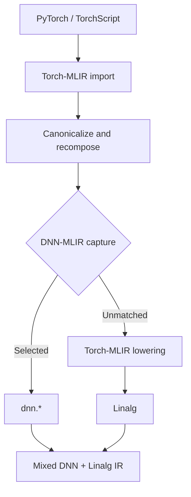

# DNN-MLIR

DNN-MLIR is an out-of-tree MLIR project for preserving selected neural-network
operations while lowering the rest of a PyTorch program through
[Torch-MLIR](https://github.com/llvm/torch-mlir).

It introduces a small `dnn` dialect and a standalone `dnn-opt` driver. Users
choose the high-level operations they want to keep, such as `dnn.lstm` or
`dnn.convolution`; unmatched Torch operations continue through Torch-MLIR's
existing Linalg-on-tensors lowering. Torch-MLIR itself is not modified.

## Table of Contents

- [Overview](#overview)
- [How It Works](#how-it-works)
- [Captures and Queries](#captures-and-queries)
- [Supported Operations](#supported-operations)
- [Build](#build)
- [Usage](#usage)
- [Project Structure](#project-structure)
- [Project Status](#project-status)

## Overview

DNN-MLIR creates mixed MLIR containing:

- high-level `dnn.*` operations selected by the user; and
- standard Linalg, tensor, arithmetic, and control-flow operations produced by
  Torch-MLIR for everything else.

For example, an LSTM can remain visible as:

```mlir
%result:3 = dnn.lstm %input, %h0, %c0, %weights ...
    : (...) -> (...)
```

while a following ReLU lowers normally to `linalg.generic`.

This provides a clean interception point for future DNN-specific analysis,
optimization, fusion, and backend lowering without maintaining a fork of
Torch-MLIR.

## How It Works



The capture pass bridges Torch tensors to builtin ranked tensors and preserves
constant configuration as operation attributes. The integrated pipeline then
uses Torch-MLIR's simplification, refinement, decomposition, and backend
conversion passes for unmatched Torch operations.

No DNN-to-Linalg lowering is performed. Captured `dnn.*` operations remain
high level in the final mixed IR.

## Captures and Queries

DNN-MLIR supports two complementary selectors.

### Captures

A capture names the DNN operation wanted in the result:

```text
captures=dnn.gru
```

This enables every registered Torch form that produces `dnn.gru`, including
both padded and packed-sequence GRUs.

### Queries

A query selects one exact Torch operation:

```text
queries=aten.gru.data
```

This captures only the packed-sequence GRU form and produces `dnn.gru`.

Captures and queries can be combined. Their selected conversions form a union:

```text
captures=dnn.linear queries=aten.mm
```

When neither option is supplied, DNN capture is skipped and Torch-MLIR handles
the complete program normally.

To inspect every registered mapping:

```bash
<dnn-mlir-build>/bin/dnn-opt --list-available-queries
```

The output is grouped by family:

```text
Recurrent:
  Capture: dnn.lstm
  Queries:
    aten.lstm.input
    aten.lstm.data

  Capture: dnn.gru
  Queries:
    aten.gru.input
    aten.gru.data
```

## Supported Operations

| Family | DNN operations | Notes |
| --- | --- | --- |
| Matrix | `dnn.mm` | Rank-two matrix multiplication |
| Affine | `dnn.linear` | Linear transformation with optional bias |
| Activation | `dnn.relu`, `dnn.gelu`, `dnn.softmax`, and others | Individual operations for 40 activation and softmax forms |
| Convolution | `dnn.convolution` | Convolution, transposed convolution, grouped convolution, and backward forms |
| Recurrent | `dnn.lstm`, `dnn.gru`, `dnn.rnn` | Padded and packed inputs; tanh and ReLU vanilla RNNs |

The optimizer's query listing is the authoritative inventory of supported
Torch-to-DNN mappings.

## Build

### Requirements

- CMake 3.22 or newer
- Ninja
- An initialized Torch-MLIR submodule and compatible build
- `ccache` is recommended

Clone the repository with its Torch-MLIR submodule:

```bash
git clone --recurse-submodules <repository-url>
```

For an existing clone:

```bash
git submodule update --init --recursive
```

Build `externals/torch-mlir` following its upstream instructions. Torch-MLIR
and DNN-MLIR are both normal out-of-tree CMake projects: their build
directories may be placed anywhere and are never created implicitly.

```text
dnn-mlir/
├── cmake/
├── externals/
│   └── torch-mlir/  # Pinned upstream submodule
├── include/
├── lib/
├── test/
└── tools/
```

Configure DNN-MLIR with the locations of the MLIR and LLVM packages produced by
your chosen Torch-MLIR build directory:

```bash
cmake -G Ninja -S <dnn-mlir-source> -B <dnn-mlir-build> \
  -DMLIR_DIR=<torch-mlir-build>/lib/cmake/mlir \
  -DLLVM_DIR=<torch-mlir-build>/lib/cmake/llvm \
  -DLLVM_EXTERNAL_LIT=<torch-mlir-build>/bin/llvm-lit \
  -DCMAKE_BUILD_TYPE=RelWithDebInfo \
  -DCMAKE_C_COMPILER_LAUNCHER=ccache \
  -DCMAKE_CXX_COMPILER_LAUNCHER=ccache \
  -DCMAKE_DISABLE_PRECOMPILE_HEADERS=ON

cmake --build <dnn-mlir-build> -j2
cmake --build <dnn-mlir-build> --target check-dnn-mlir -j2
```

DNN-MLIR infers the Torch-MLIR build root from `MLIR_DIR`. For a nonstandard
layout, set `DNN_MLIR_TORCH_MLIR_BINARY_DIR` explicitly.

## Usage

Preserve all supported LSTM forms and lower everything else toward Linalg:

```bash
<dnn-mlir-build>/bin/dnn-opt \
  --dnn-backend-to-linalg-on-tensors-backend-pipeline='captures=dnn.lstm' \
  input.mlir
```

Capture one exact Torch form:

```bash
<dnn-mlir-build>/bin/dnn-opt \
  --dnn-backend-to-linalg-on-tensors-backend-pipeline='queries=aten.gru.data' \
  input.mlir
```

## Project Structure

```text
dnn-mlir/
├── cmake/                         # Dependency and build integration
├── externals/
│   └── torch-mlir/                # Pinned upstream submodule
├── include/dnn-mlir/
│   ├── Conversion/TorchToDNN/  # Pass, pipeline, and registry interfaces
│   └── Dialect/DNN/IR/         # DNN dialect and operation definitions
├── lib/
│   ├── Conversion/TorchToDNN/  # Torch query implementations by family
│   └── Dialect/DNN/IR/         # Dialect implementation and verification
├── test/
│   ├── CLI/
│   ├── Conversion/
│   ├── Dialect/
│   └── Pipeline/
└── tools/dnn-opt/              # Standalone optimizer driver
```

## Project Status

DNN-MLIR is an early-stage compiler project. It currently provides a working
high-level capture layer and mixed DNN/Linalg pipeline with regression coverage.

It does not yet provide:

- a DNN runtime or executable backend;
- DNN-to-hardware or DNN-to-Linalg lowering;
- complete semantic, shape, and type verification for every DNN operation; or
- a DNN-aware replacement for Torch-MLIR's final backend verifier.

These boundaries are intentional: the current project establishes the dialect,
capture model, and integration point on which those components can be built.
