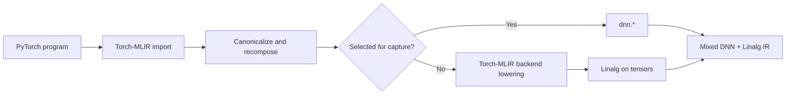

# DNN-MLIR

DNN-MLIR is an experimental, out-of-tree MLIR project that preserves selected
neural-network operations as high-level `dnn.*` operations while lowering the
rest of a PyTorch program to Linalg through
[Torch-MLIR](https://github.com/llvm/torch-mlir).

The project provides a standalone `dnn-mlir-opt` driver and one integrated
backend pipeline. It composes with a pinned Torch-MLIR checkout and does not
modify or fork Torch-MLIR.

> **Project status:** DNN-MLIR is under active development. The capture pipeline,
> dialect, tests, and installable CMake package are working; a production
> runtime and DNN-to-hardware lowering are not yet provided.

## Contents

- [Why DNN-MLIR?](#why-dnn-mlir)
- [Quick example](#quick-example)
- [Pipeline](#pipeline)
- [Selecting operations](#selecting-operations)
- [Supported operations](#supported-operations)
- [Build and test](#build-and-test)
- [Install](#install)
- [Design contracts](#design-contracts)
- [Repository layout](#repository-layout)
- [Current limitations](#current-limitations)

## Why DNN-MLIR?

Torch-MLIR normally decomposes and lowers PyTorch operations into progressively
lower-level dialects. That is the right path for general-purpose compilation,
but it removes the high-level identity of operations that a DNN optimizer or
accelerator backend may want to recognize directly.

DNN-MLIR adds a configurable interception layer:

- selected operations remain visible as `dnn.linear`, `dnn.convolution`,
  `dnn.lstm`, and other DNN operations;
- every unselected Torch operation follows Torch-MLIR's existing
  Linalg-on-tensors lowering; and
- the result is valid mixed DNN and Linalg IR ready for downstream compiler
  work.

DNN-MLIR does **not** lower captured operations back to Linalg. Its purpose is
to preserve their semantics and abstraction level for a later DNN-aware
optimizer or backend.

## Quick example

Given Torch dialect IR containing a linear layer followed by ReLU:

```mlir
func.func @forward(
    %input: !torch.vtensor<[2,3],f32>,
    %weight: !torch.vtensor<[4,3],f32>,
    %bias: !torch.vtensor<[4],f32>) -> !torch.vtensor<[2,4],f32> {
  %0 = torch.aten.linear %input, %weight, %bias
      : !torch.vtensor<[2,3],f32>, !torch.vtensor<[4,3],f32>,
        !torch.vtensor<[4],f32> -> !torch.vtensor<[2,4],f32>
  %1 = torch.aten.relu %0
      : !torch.vtensor<[2,4],f32> -> !torch.vtensor<[2,4],f32>
  return %1 : !torch.vtensor<[2,4],f32>
}
```

Run the integrated backend pipeline and capture only the linear operation:

```bash
build/bin/dnn-mlir-opt \
  --dnn-backend-to-linalg-on-tensors-backend-pipeline='captures=dnn.linear' \
  input.mlir
```

The result preserves the linear layer while Torch-MLIR lowers ReLU:

```mlir
func.func @forward(
    %input: tensor<2x3xf32>,
    %weight: tensor<4x3xf32>,
    %bias: tensor<4xf32>) -> tensor<2x4xf32> {
  %0 = dnn.linear %input, %weight, %bias
      : tensor<2x3xf32>, tensor<4x3xf32>, tensor<4xf32>
        -> tensor<2x4xf32>
  %1 = linalg.generic ... ins(%0 : tensor<2x4xf32>) ...
      -> tensor<2x4xf32>
  return %1 : tensor<2x4xf32>
}
```

The complete executable example lives in
[`test/Pipeline/fx-backend-to-linalg.mlir`](test/Pipeline/fx-backend-to-linalg.mlir).

## Pipeline



The public entry point is:

```text
--dnn-backend-to-linalg-on-tensors-backend-pipeline
```

Internally, the pipeline canonicalizes Torch IR, reconstructs supported
high-level patterns where possible, captures the requested operations,
functionalizes mutation, and delegates unmatched operations to Torch-MLIR. A
final backend-contract verifier rejects residual Torch operations, Torch types,
conversion bridges, and unresolved casts.

## Selecting operations

The pipeline accepts two complementary selectors:

| Selector | Meaning | Example |
| --- | --- | --- |
| `captures` | Select the DNN operation wanted in the result | `captures=dnn.lstm` |
| `queries` | Select one exact source Torch operation | `queries=aten.lstm.data` |

A capture enables every registered source form that produces that DNN
operation. For example, `captures=dnn.lstm` handles both padded and packed LSTM
forms. A query is narrower: `queries=aten.lstm.data` captures only that exact
packed-sequence form, but still produces `dnn.lstm`.

Selectors form a union and can be combined:

```bash
build/bin/dnn-mlir-opt \
  --dnn-backend-to-linalg-on-tensors-backend-pipeline='captures=dnn.linear queries=aten.mm' \
  input.mlir
```

Use `captures=all` or `queries=all` to enable every registered conversion. If
neither selector is supplied, DNN capture is skipped and Torch-MLIR handles the
complete program.

List the authoritative capture and query registry with:

```bash
build/bin/dnn-mlir-opt --list-available-queries
```

## Supported operations

| Family | DNN operations | Coverage |
| --- | --- | --- |
| Activation | `dnn.relu`, `dnn.gelu`, `dnn.softmax`, and others | Individual operations for activation, softmax, and backward forms |
| Affine | `dnn.linear` | Linear transformation with optional bias |
| Attention | `dnn.scaled_dot_product_attention` | Mask, scale, and causal configuration |
| Convolution | `dnn.convolution` | Standard, transposed, grouped, and backward forms |
| Elementwise | `dnn.add`, `dnn.mul` | Tensor operations with broadcasting |
| Embedding | `dnn.embedding` | Learned table lookup |
| Matrix | `dnn.mm`, `dnn.matmul` | Rank-two and rank-polymorphic multiplication |
| Normalization | `dnn.batch_norm`, `dnn.layer_norm` | Batch and layer normalization |
| Pooling | `dnn.max_pool2d`, `dnn.adaptive_avg_pool2d` | Spatial and adaptive pooling |
| Recurrent | `dnn.lstm`, `dnn.gru`, `dnn.rnn` | Padded and packed inputs; tanh and ReLU RNNs |
| Shape | `dnn.flatten` | Contiguous-dimension flattening |

The registry printed by `--list-available-queries` is the exact, current list
of source-to-DNN mappings. Full-model regression inputs currently cover
ResNet-18, MobileNetV3, ViT-B/16, BERT Base, and GPT-2 Small.

## Build and test

### Requirements

- CMake 3.22 or newer
- Ninja
- a C++17 compiler
- the pinned Torch-MLIR submodule and its LLVM/MLIR dependencies
- `ccache` (recommended)

Clone the repository and all nested dependencies:

```bash
git clone --recurse-submodules https://github.com/PlatinumCD/dnn-mlir.git
cd dnn-mlir
```

If the repository was cloned without submodules:

```bash
git submodule update --init --recursive
```

Build `externals/torch-mlir` using its
[upstream development instructions](https://github.com/llvm/torch-mlir/blob/main/docs/development.md).
DNN-MLIR is tested against the exact Torch-MLIR and LLVM revisions pinned by
the submodule; other revisions are not guaranteed to be compatible.

Then configure DNN-MLIR against that Torch-MLIR build:

```bash
export TORCH_MLIR_BUILD=/absolute/path/to/torch-mlir-build

cmake -G Ninja -S . -B build \
  -DMLIR_DIR="$TORCH_MLIR_BUILD/lib/cmake/mlir" \
  -DLLVM_DIR="$TORCH_MLIR_BUILD/lib/cmake/llvm" \
  -DLLVM_EXTERNAL_LIT="$TORCH_MLIR_BUILD/bin/llvm-lit" \
  -DCMAKE_BUILD_TYPE=RelWithDebInfo \
  -DCMAKE_C_COMPILER_LAUNCHER=ccache \
  -DCMAKE_CXX_COMPILER_LAUNCHER=ccache \
  -DCMAKE_DISABLE_PRECOMPILE_HEADERS=ON

cmake --build build --parallel 2
cmake --build build --target check-dnn-mlir --parallel 2
```

DNN-MLIR normally infers the Torch-MLIR build root from `MLIR_DIR`. Set
`DNN_MLIR_TORCH_MLIR_BINARY_DIR` explicitly when using a nonstandard layout.

The test target covers dialect verification, individual conversions,
integrated pipelines, full-model capture snapshots, installation, and a
downstream CMake consumer. Numerical reference-backend tests are enabled when a
compatible PyTorch, NumPy, and Torch-MLIR Python environment is available.

## Install

Install the optimizer, headers, libraries, and CMake package into a standalone
prefix:

```bash
cmake --install build --prefix /absolute/path/to/dnn-mlir-install
```

A downstream compiler can consume the exported targets with:

```cmake
find_package(DNNMLIR CONFIG REQUIRED)

target_link_libraries(my-compiler PRIVATE
  DNNMLIR::DNNIR
  DNNMLIR::DNNTorchToDNN
)
```

Because Torch-MLIR currently exposes the required C++ components as build-tree
archives, downstream projects must also provide compatible Torch-MLIR source
and build trees through `DNN_MLIR_TORCH_MLIR_SOURCE_DIR` and
`DNN_MLIR_TORCH_MLIR_BINARY_DIR`.

## Design contracts

### Value semantics

Every `dnn.*` operation is functional and value-semantic. DNN operations do
not mutate operands or carry PyTorch aliasing semantics. In-place Torch
operations are functionalized before capture:

```text
aten.relu_       -> Torch functionalization -> aten.relu       -> dnn.relu
aten.add_.Tensor -> Torch functionalization -> aten.add.Tensor -> dnn.add
```

Direct in-place-to-DNN registrations are intentionally excluded from the
capture registry.

### Backend boundary

Successful pipeline output contains builtin ranked tensors and may contain
`dnn`, Linalg, tensor, arithmetic, and control-flow operations. It must not
contain Torch operations, Torch types, conversion bridges, or unresolved
casts. Captured `dnn.*` operations remain high level.

### Numerical validation

Semantic tests compare eager PyTorch execution with DNN capture followed by a
test-only restoration to Torch and Torch-MLIR reference-backend execution:

```text
PyTorch eager
    compared with
Torch-MLIR import -> DNN capture -> test-only restoration
                  -> Linalg lowering -> reference execution
```

Restoration exists only to validate capture semantics; it is not a production
DNN-to-Linalg lowering.

## Repository layout

```text
dnn-mlir/
├── cmake/                         # Build and package integration
├── externals/
│   └── torch-mlir/                # Pinned upstream submodule
├── include/dnn-mlir/
│   ├── Conversion/TorchToDNN/     # Public conversion interfaces
│   └── Dialect/DNN/IR/            # Dialect and operation definitions
├── lib/
│   ├── Conversion/TorchToDNN/     # Query implementations by operation family
│   └── Dialect/DNN/IR/            # Dialect implementation and verification
├── test/
│   ├── Conversion/                # Per-operation conversion tests
│   ├── Models/                    # Full-model capture snapshots
│   ├── Pipeline/                  # Integrated pipeline tests
│   └── Semantics/                 # Numerical equivalence tests
└── tools/dnn-mlir-opt/            # Standalone optimizer
```

## Current limitations

DNN-MLIR does not yet provide:

- a DNN runtime or executable backend;
- production DNN-to-hardware or DNN-to-Linalg lowering;
- numerical coverage for every registered operation;
- complete operation-specific shape and type verification; or
- a stable public API or compatibility guarantee across Torch-MLIR revisions.

The current project establishes the dialect, capture model, verification
boundary, and integration layer on which those components can be built.
